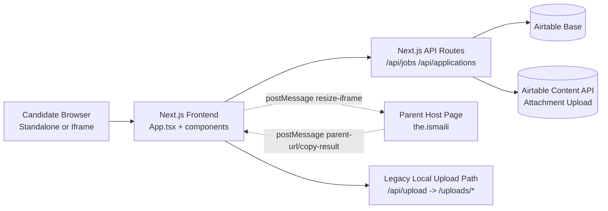

# Architecture Overview

## System Diagram

## Architecture Notes

## Frontend

- Main shell and orchestration: `App.tsx`
- UI components: `components/*`
- Key patterns:
  - job list/details split view
  - in-pane apply flow (replaces modal overlay for iframe reliability)
  - per-job draft preservation for application form
  - URL sync for selected job and view state

## API Layer

Route handlers:
- `GET /api/jobs`
- `POST /api/applications`
- `POST /api/upload` (legacy)
- `GET /uploads/[...path]` (legacy)

Shared integration logic:
- `lib/airtable.ts` (Airtable read/write + attachment upload)
- `lib/api-response.ts` (consistent JSON responses)

## Data Layer

Airtable acts as operational datastore:
- Jobs (GE Roles)
- People
- Applications
- (Recommended extension) Referrals

## Upload Flow

## Primary (current)

Application submission includes base64 attachment payload:
- frontend -> `POST /api/applications`
- backend creates application record
- backend uploads attachment via Airtable content API
- backend patches attachment onto application record

## Legacy (still available)

- frontend -> `POST /api/upload` (local file write)
- file served via `GET /uploads/[...path]`

This exists for compatibility; the preferred production flow is Airtable-native attachment upload.

## Hosting / Deployment

- App is built and served as Next.js application
- Embedded use-case:
  - parent page hosts iframe
  - child app adjusts iframe height via `postMessage`
- Operational concerns:
  - cache invalidation after deploys
  - third-party host scripts (GTM/vendor plugins) can introduce console noise unrelated to app code

## Reliability and Security Notes

- Env vars gate Airtable access (`AIRTABLE_*`)
- API routes run server-side (`runtime = nodejs`)
- Attachment upload requires existing application record and valid base64 payload
- Path traversal checks are enforced for legacy local file serving
